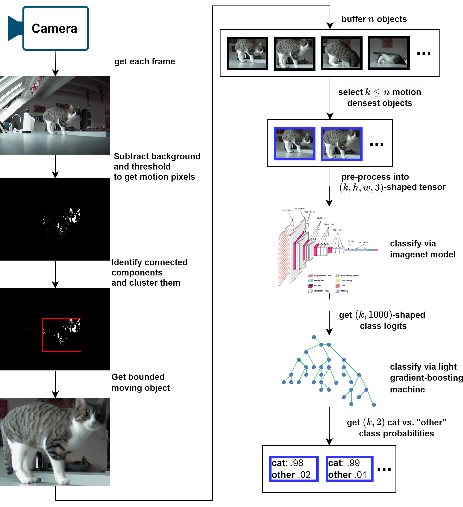
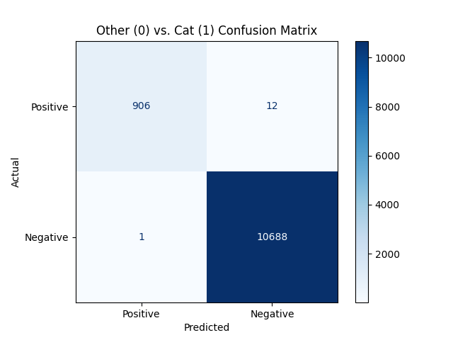
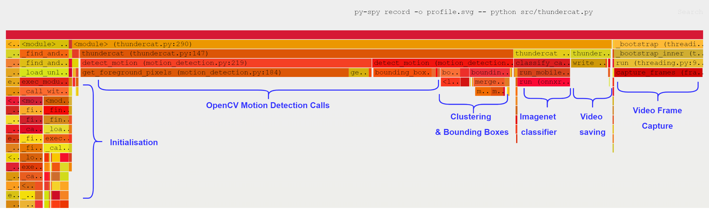

# thunder-cat
This here is Lyra:
<p align="center">
  
</p>

She is a cute and very curious cat who likes to explore every space. That unfortunately also includes our kitchen counters, which poses both a health hazard to herself and us. After trying conventional deterrents (tape, water gun, etc.) and none of them worked, we have developed a computer-vision and sound-based deterrent. In essence, we detect whether a cat appears in a camera and play sounds (e.g thunder) it doesn't like so it learns to avoid the space.

### Hardware Setup
The hardware used is composed as follows:

<p align="center">
  
</p>

Where the parts are:
- [**Raspberry Pi 5, 8GB**](https://www.digikey.ch/de/products/detail/raspberry-pi/SC1112/21658257?so=89455186&content=productdetail_CH) - the setup uses ~4.5GB, so the smaller variant will start using the swap space
- [**27W USB-C PSU**](https://www.digikey.ch/de/products/detail/raspberry-pi/SC1407/21658269?so=89455186&content=productdetail_CH)
- [**Arducam 2MP IMX462 Day and IR Night Vision USB Camera with Metal Case**](https://www.arducam.com/product/arducam-2mp-imx462-day-and-ir-night-vision-usb-camera-with-metal-case/) - would probably not buy again. It was easy to use and functioned at night, but the images were very noisy and would occasionally throw off the background subtractor. No amount of tweaking seemed to make this fully go away.
- [**52Pi Ice Tower Plus for Raspberry Pi 5, Aluminum Heatsink**](https://52pi.com/products/ice-tower-plus-for-raspberry-pi-5-for-raspberry-pi-5) - haven't done a detailed temperature analysis, but this did lower the operating temperature from 75°C -> 50°C. Probably don't need a cooler this powerful, but it is nice and quiet.
- [**Creative T60 Speakers**](https://en.creative.com/p/speakers/creative-t60) - overkill, some cheaper speakers would do fine, but I already
had them and they're good speakers.

### How it works
There are 2 main components to the implementation: identifying objects and classifying them as a "cat" or something "other". See below diagram for the two steps:

<p align="center">
  
</p>

#### Object Detection
We use a background subtractor to learn the distribution of the pixels in the video feed (important, as the camera is noisy) and the subtract each new frame to get the pixels that have changed. When an object (i.e the cat) moves, this results in pixel clusters that differ from the background. We can then detect the clusters and merge them to get a bounding box, which we use to get the moving object. This approach is not perfectly accurate, but it is very efficient.

#### Classification
Once we have collected some $n$ frames, we sample the $k$ ones with the most amount of motion (as more motion lets us draw more accurate boxes). We then pass these into a model pre-trained on the 1K [imagenet dataset](https://paperswithcode.com/dataset/imagenet) and get back a tensor of $(k, 1000)$ class weights.

Now imagenet does have 5 classes for housecats, so it is quite straightforward to detect a "cat" based on probability of those. However, more difficult is capturing the "other" class  (everything that is not a cat) and relying just on the "cat" class probabilities. Doing so leads to _false positives_, such as confusing human hair or very fuzzy sweaters for a cat. One approach could be to replace the imagenet model's classification head with one that only has those 2 classes and fine-tune on either the original imagenet data or our own. This is however, quite computationally intensive to do and even just running inference on a raspberry pi is slow.

Instead we opted to treat the $(k, 1000)$ imagenet class scores as features of their own and trained a [Light-Gradient Boosting Machine (LGBM)](https://lightgbm.readthedocs.io/en/stable/) on a few hours of house-cat and non-cat data. This turned out to be fast enough, that we could even perform hyper-parameter tuning such that with $k$-fold validation, the model has a 0.01% false positive rate and a 1.3% false negative rate (we prioritised minimising false positives).

<p align="center">
  
</p>

### Demo
Here is an example recording of the camera recognising Lyra and playing sounds to deter her.
<p align="center">
  
</p>

### Performance
As we are using a CPU-only setup, it is worthwhile to inspect the performance. The below flamechart is from classifying a 5min video recorded using the camera. We can observe that the main performance bottleneck is from the motion capture OpenCV operations which needed to be run on every frame. These already run some optimised C++ code underneath, so there's not many easy optimisations that would not require rewriting most of the code. Even porting everything to C++ will probably not improve performance substantially and the code already uses all threads, so 480p at 30FPS is likely the limit of what the raspberry pi can manage. Raising the resolution to 720p already lowers the FPS to 15, so it is not advisable.

<p align="center">
  
</p>

### Data
The data for the training is not shared within the repository for privacy reasons. However, it is not difficult
to gather with the camera setup. Around 3000 cat video frames and 10000 other video frames were used to train the
downstream LGBM classifier, which at a sampling rate of roughly 1 in 10 frames corresponds to 30000+100000 = 130k frames in total. At 30FPS this is only about 1.2h of video, which is easy to gather and train on-device. It may also not even be necessary as the LGBM classifier should work out of the box for most cats vs. non-cats.

## Installation
1. Install Python 3.11.*.
2. Install linux video and audio utilities: `sudo apt install v4l-utils ffmpeg libportaudio2`.
3. Create a virtual environment and `pip install -r requirements.txt --extra-index-url https://download.pytorch.org/whl/cpu`. The extra flag is to ensure we only install the CPU-version of PyTorch.
4. Add the source code folder to `PYTHONPATH` (i.e `export PYTHONPATH="${PYTHONPATH}:${PWD}/src"`)
5. Run `./generate_data_folders.sh` to create the folders to contain sound, video and logging data.
6. (Optional) add your user to the `video` and `audio` groups: `sudo usermod -aG audio <user_name>` in case
the speaker or camera are not visible without `sudo` privileges.
7. (Optional) run `pre-commit install` to enable pre-commit hooks.

## Running
By default, the application's main entrypoint is the `src/thundercat.py` file. It does not have a commandline and can simply be run with with:

- ```python ./src/thundercat.py```

It is also possible to train the LGBM classifier using the `analysis.py`, which expects training videos in `data/video/evaluation/cat` and `data/video/evaluation/other` respectively. It is runnable via:

- ```python ./src/analysis.py```

To view when the classifier detected a cat in the logs, run:

- ```python src/log_checker.py```

### Streaming to another device
By default, the output of `thundercat.py` are video and log files in `data/log`. It is also possible to stream the video to another device though using the instructions below.
1. Determine the host IP address (e.g `ifconfig`) and a free port and assign them to Env variables `HOST_IP` and `HOST_PORT` on the device side.
2. Run `python ./src/thundercat.py` on the device side.
3. On the host side, receive the video with a suitable UDP streaming tool. E.g `ffplay -fflags nobuffer udp://<HOST_IP>:<HOST_PORT>?pkt_size=1316`

### Running the application as a service
To setup the application as a service, use the `thundercat.service` file (NOTE: set `User` and `Group` to the user name).
1. Verify the the service file: `sudo systemd-analyze verify thundercat.service`
2. Copy the file to the OS services: `sudo cp thundercat.service /etc/systemd/system/thundercat.service`
3. Reload the service daemon: `sudo systemctl daemon-reload`
4. Start the service: `sudo systemctl start thundercat`
5. Enable it to start on OS boot: `sudo systemctl enable thundercat`

For debugging, run:
- `sudo systemctl status thundercat` to check the service status
- `tail -f /var/log/thundercat.log` to inspect STDOUT log
- `tail -f /var/log/thundercat_error.log` to inspect STDERR log

Additionally, you may want to periodically restart the device (there are no known memory leaks, but it is still better to do so). This can be done via a CRON job:
1. Open the CRON editor `sudo crontab -e`
2. Add a line to restart at 02:00 `0 2 * * * /sbin/shutdown -r now >> /var/log/restart.log 2>&1`
3. Check the job is added `sudo crontab -l`

## Other

### Logging
The logging of the code can be controlled with the `LOG_LEVEL` env var. For example `export LOG_LEVEL="DEBUG"`.

